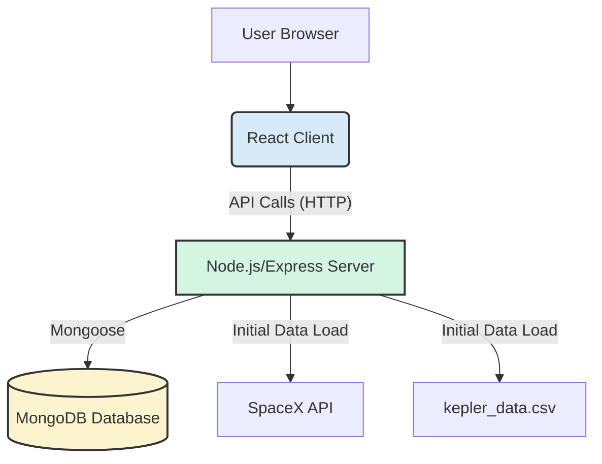

# NASA Mission Control - System Architecture

This document outlines the architecture of the NASA Mission Control project, including its structure, components, data flow, and key design decisions.

## 1. Overview

The application follows a **Client-Server architecture**:

- **Client (Frontend):** A React single-page application (SPA) responsible for the user interface, user interactions, and communication with the backend API. It uses the `arwes` library for a thematic UI.
- **Server (Backend):** A Node.js application using the Express framework. It provides a RESTful API for the client, manages data persistence, interacts with external services (SpaceX API), and performs business logic related to planets and launches.
- **Database:** MongoDB is used as the database, accessed by the server via the Mongoose ODM. It stores information about habitable planets and launch missions.
- **Containerization:** Docker is used to package the application (both client build and server) into a container for consistent development, testing, and deployment.



## 2. Project Folder Structure

The project uses a monorepo structure, keeping the client and server code within the same repository but in separate directories.

```
nasa-project/
├── README.md             # Main project README
├── Dockerfile            # Defines the Docker image build process
├── package.json          # Root package file (scripts for client/server)
├── .dockerignore         # Files to ignore during Docker build
├── client/               # React Frontend Application
│   ├── package.json      # Client dependencies and scripts
│   ├── public/           # Static assets (index.html, images, sounds)
│   └── src/              # Client source code
│       ├── App.js        # Main application component with providers
│       ├── index.js      # Entry point for React app
│       ├── settings.js   # Arwes theme, resources, sounds config
│       ├── components/   # Reusable UI components (Header, Footer, etc.)
│       ├── hooks/        # Custom React Hooks (data fetching, logic)
│       │   ├── requests.js # API interaction functions
│       │   ├── useLaunches.js # State and logic for launches
│       │   └── usePlanets.js  # State and logic for planets
│       └── pages/        # Page-level components (connected to routes)
│           ├── AppLayout.js # Main layout with header/footer/routing
│           ├── History.js   # Launch history page
│           ├── Launch.js    # Launch scheduling page
│           └── Upcoming.js  # Upcoming launches page
└── server/               # Node.js Backend Application
    ├── package.json      # Server dependencies and scripts
    ├── .env              # Environment variables (MONGO_URL, PORT) - Not committed
    ├── data/             # Data files (e.g., Kepler CSV)
    │   └── kepler_data.csv
    └── src/              # Server source code
        ├── app.js        # Express app configuration (middleware, routing)
        ├── server.js     # Main server entry point (HTTP server, DB connection, data loading)
        ├── models/       # Data handling logic and database interaction
        │   ├── *.model.js  # Business logic for data entities (planets, launches)
        │   └── *.mongo.js  # Mongoose schema definitions
        ├── routes/       # API route definitions and controllers
        │   ├── api.js      # Main API router (v1)
        │   ├── launches/   # Launches API endpoints
        │   │   ├── *.controller.js # Request/response handling logic
        │   │   ├── *.router.js     # Express router definition
        │   │   └── *.test.js       # API tests for launches
        │   └── planets/    # Planets API endpoints
        │       ├── *.controller.js
        │       └── *.router.js
        └── services/     # Shared utilities and services
            ├── mongo.js    # MongoDB connection logic
            └── query.js    # Pagination helper
```

## 3. Major Components

### 3.1. Client (React App)

- **`create-react-app` base:** Standard setup for React development.
- **`App.js`:** Root component, sets up Arwes Theme/Sounds/Background providers and React Router.
- **`Arwes`:** Provides the sci-fi UI components, animations, and sound effects. Configured in `settings.js`.
- **Routing (`react-router-dom`):** Manages navigation between pages (`Launch`, `Upcoming`, `History`) within the `AppLayout.js` component.
- **Pages (`pages/`):** Represent distinct views in the application. They fetch data using custom hooks and render UI components.
- **Components (`components/`):** Reusable UI elements like `Header`, `Footer`, `Centered`, `Clickable`.
- **Hooks (`hooks/`):**
  - `usePlanets`: Fetches planet data and stores it in state.
  - `useLaunches`: Fetches launch data, provides functions to submit/abort launches, and manages related state (including pending status).
  - `requests.js`: Contains functions (`httpGetPlanets`, `httpGetLaunches`, etc.) that use the `fetch` API to communicate with the backend REST API.
- **State Management:** Primarily uses React's built-in hooks (`useState`, `useEffect`, `useCallback`, `useMemo`) within custom hooks and components.

### 3.2. Server (Node.js/Express API)

- **`server.js`:** Entry point. Initializes the HTTP server, connects to MongoDB (`mongoConnect`), and triggers initial data loading (`loadPlanetsData`, `loadLaunchData`).
- **`app.js`:** Configures the Express application. Sets up middleware (CORS, Morgan logging, JSON parsing), serves the static client build (`express.static`), and defines the main API router (`/v1`). Includes a catch-all route (`/*`) to serve `index.html` for client-side routing.
- **`routes/`:** Defines the API endpoints.
  - `api.js`: Mounts specific routers (planets, launches) under the `/v1` path.
  - `*/\*.router.js`: Uses `express.Router()` to define routes for specific resources (e.g., `GET /launches`, `POST /launches`).
  - `*/\*.controller.js`: Handles the logic for each route, processing requests, calling model functions, and sending responses.
- **`models/`:** Encapsulates data structures and business logic.
  - `*.mongo.js`: Defines Mongoose schemas, mapping directly to MongoDB collections (`planets`, `launches`).
  - `*.model.js`: Contains functions that interact with the Mongoose schemas and perform operations like fetching data (`getAllPlanets`, `getAllLaunches`), adding data (`scheduleNewLaunch`), checking existence (`existsLaunchWithId`), loading initial data (`loadPlanetsData`, `loadLaunchData`), and updating data (`abortLaunchById`).
- **`services/`:** Contains reusable utility functions.
  - `mongo.js`: Manages the MongoDB connection lifecycle.
  - `query.js`: Provides helper functions for features like pagination.
- **Data Loading:** On startup, the server reads `kepler_data.csv` and fetches data from the SpaceX API to populate the MongoDB database if it's empty.

### 3.3. Database (MongoDB)

- Stores two main collections:
  - `planets`: Contains the names (`keplerName`) of habitable exoplanets.
  - `launches`: Contains details about space missions (both SpaceX and user-scheduled), including flight number, mission name, rocket type, launch date, destination (`target`), success status, upcoming status, and customers.
- Accessed exclusively by the server via Mongoose.

### 3.4. Containerization (Docker)

- **`Dockerfile`:** A multi-stage Dockerfile builds a production-optimized image.
  - Installs dependencies and builds the React client in one stage.
  - Installs _only_ production server dependencies in another stage.
  - Copies the built client, server code, and production dependencies into a final, lightweight Node.js Alpine image.
- **`.dockerignore`:** Excludes unnecessary files/folders (like `.git`, `node_modules`) from the Docker build context, speeding up the build and reducing image size.

## 4. Data Flow Examples

### 4.1. Fetching Upcoming Launches

1.  **User:** Navigates to the "/upcoming" page in the browser.
2.  **Client (React):**
    - `Upcoming.js` component renders.
    - `useLaunches` hook is called.
    - `useEffect` within `useLaunches` calls `getLaunches`.
    - `getLaunches` calls `httpGetLaunches` (in `requests.js`).
    - `fetch('/v1/launches')` sends a GET request to the server.
3.  **Server (Node/Express):**
    - Request matches `GET /v1/launches` route in `launches.router.js`.
    - `httpGetAllLaunches` controller in `launches.controller.js` is executed.
    - Controller calls `getAllLaunches` (in `launches.model.js`).
    - `getAllLaunches` queries the MongoDB `launches` collection via Mongoose (`launchesDatabase.find({...})`).
    - The model returns the launch data to the controller.
    - The controller sends a 200 OK response with the launch data (JSON) back to the client.
4.  **Client (React):**
    - `fetch` receives the response.
    - `httpGetLaunches` parses the JSON data.
    - `useLaunches` hook updates its `launches` state with the fetched data via `saveLaunches`.
    - `Upcoming.js` re-renders, filtering the `launches` state for `upcoming: true` missions and displaying them in the table.

### 4.2. Scheduling a New Launch

1.  **User:** Fills out the launch form on the "/launch" page and clicks "Launch Mission".
2.  **Client (React):**
    - The form's `onSubmit` handler calls `submitLaunch` (provided by the `useLaunches` hook).
    - `submitLaunch` prevents default form submission, sets `isPendingLaunch` state to true, gathers form data.
    - It calls `httpSubmitLaunch` (in `requests.js`) with the launch details.
    - `fetch('/v1/launches', { method: 'POST', ... })` sends a POST request with the launch data in the body.
3.  **Server (Node/Express):**
    - Request matches `POST /v1/launches` route in `launches.router.js`.
    - `httpAddNewLaunch` controller in `launches.controller.js` is executed.
    - Controller validates the incoming data (checks for required fields, valid date).
    - Controller calls `scheduleNewLaunch` (in `launches.model.js`) with the validated launch data.
    - `scheduleNewLaunch`:
      - Validates the target planet exists in the `planets` collection.
      - Gets the next available `flightNumber`.
      - Assigns defaults (upcoming=true, success=true, customers).
      - Calls `saveLaunch` to upsert the new launch into the MongoDB `launches` collection via Mongoose (`launchesDatabase.findOneAndUpdate({...}, {upsert: true})`).
    - The model confirms success back to the controller.
    - Controller sends a 201 Created response with the newly created launch data back to the client.
4.  **Client (React):**
    - `fetch` receives the 201 response.
    - `httpSubmitLaunch` returns the successful response.
    - `submitLaunch` calls `getLaunches` again to refresh the list, plays a success sound, and sets `isPendingLaunch` back to false.
    - The UI updates (e.g., the new launch appears in the "Upcoming" list if navigated there).

## 5. Design Decisions

- **Monorepo:** Simplifies dependency management and cross-component work (client/server) within a single repository structure. Uses root `package.json` scripts to orchestrate tasks.
- **Separation of Concerns (Server):** Adopts a layered approach (Routes -> Controllers -> Models -> Services) to organize backend logic, improving maintainability and testability. Mongoose models handle database interaction logic, while controllers manage HTTP request/response flow.
- **Mongoose ODM:** Provides schema definition, validation, and simplifies interaction with MongoDB compared to using the native driver directly.
- **RESTful API:** The server exposes a standard REST API for client-server communication, making it potentially usable by other clients as well. Versioned (`/v1`) for future compatibility.
- **Custom React Hooks:** Encapsulate data fetching, state management, and side effects related to specific features (planets, launches) on the client, making components cleaner.
- **Initial Data Loading:** Populating the database on server start (from CSV and external API) simplifies setup and ensures the application has necessary data immediately. The check prevents redundant loading on subsequent restarts.
- **Docker Multi-Stage Build:** Creates optimized, smaller, and more secure production Docker images by separating build dependencies from runtime dependencies.
- **`arwes` UI Library:** Chosen specifically for its thematic fit with the "space mission" concept, enhancing user engagement.
- **Error Handling:** Basic error handling is implemented (e.g., checking missing fields, invalid dates), but could be further enhanced with more specific error types and user feedback.
- **Testing:** Includes unit/integration tests for the backend API (`Jest`, `Supertest`) and sets up the structure for frontend tests (`react-scripts test`), promoting code quality.
